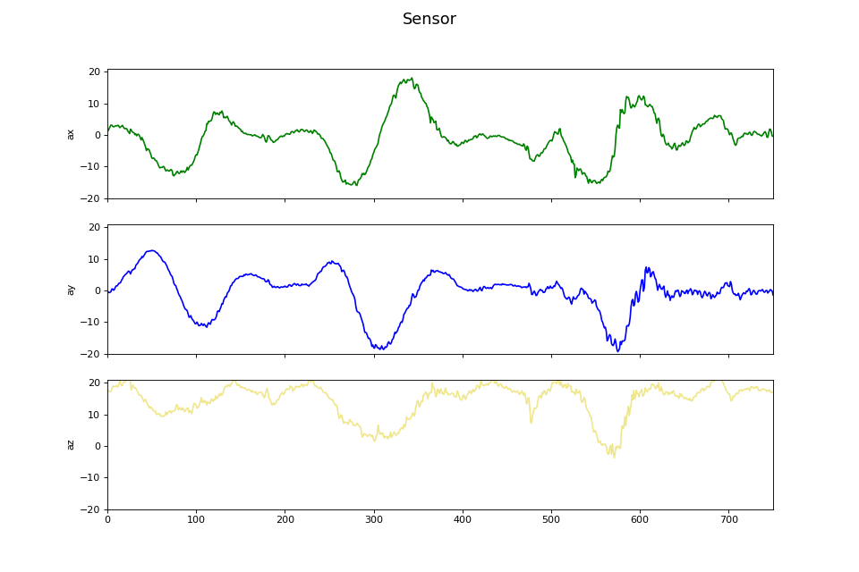
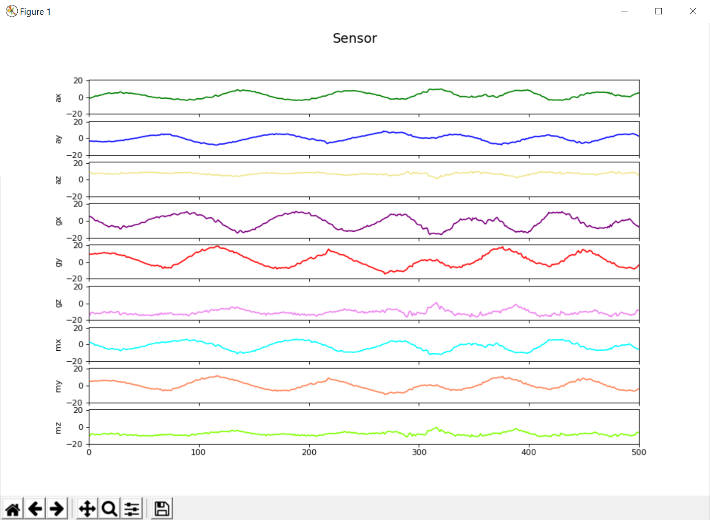
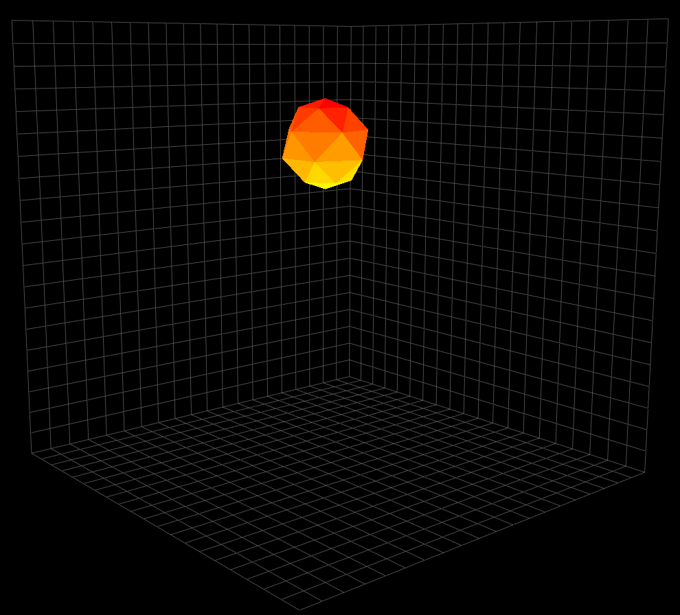
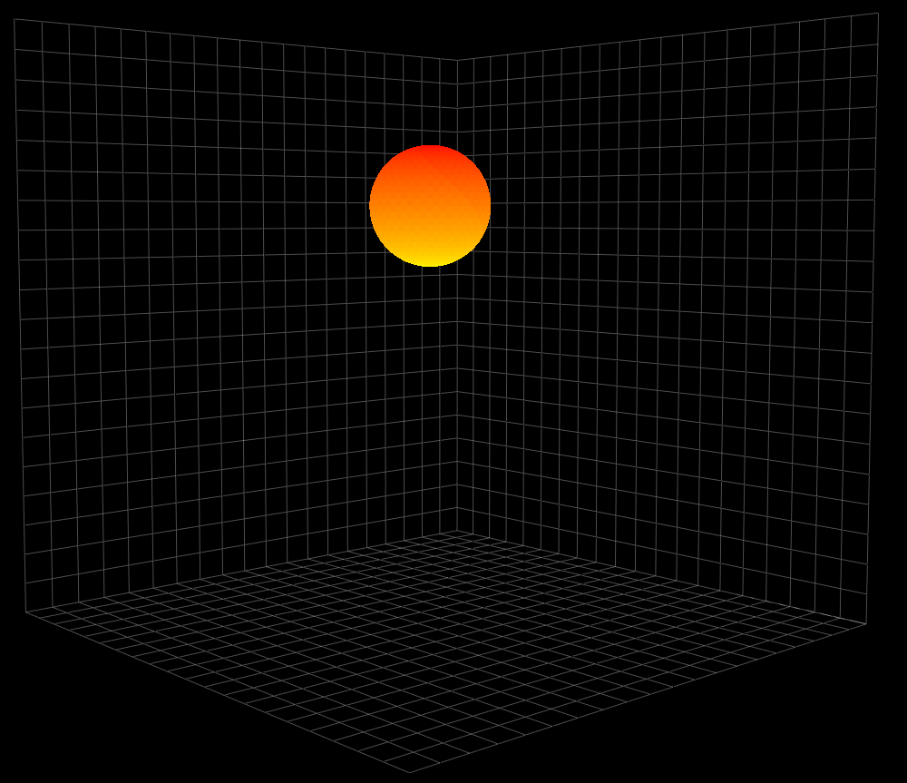
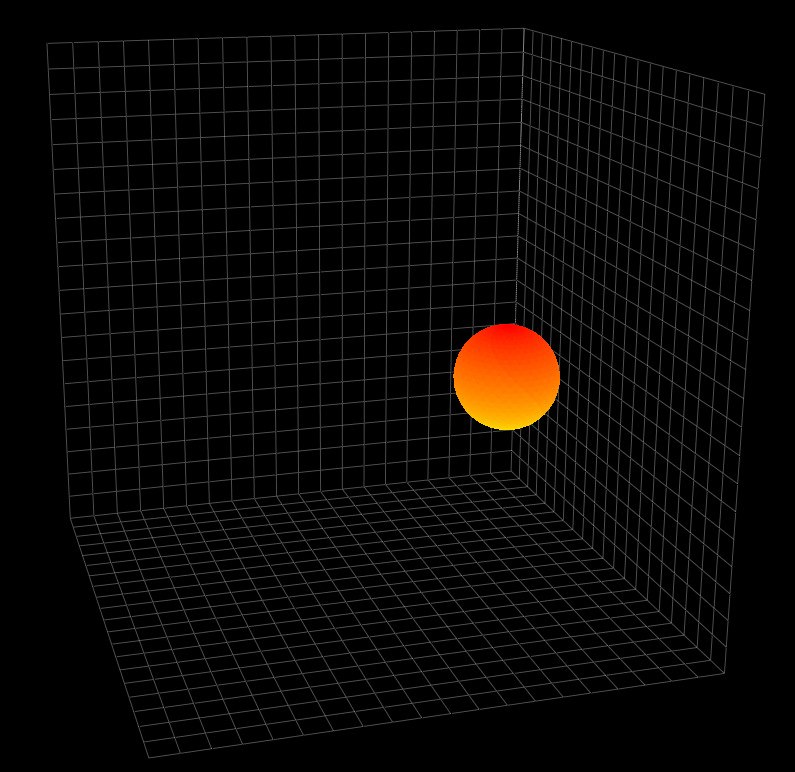

## Real-time-embedded-visualisation
Real time 2d and 3d visualisation for 9-axis accelerometer sensor with python matplotlib and openGL.
It was made for data visualisation of sea buoy embedded system for debbuging process.

## Communication.py
Script defines classes for different methods of gathering data from microcontroller (Serial/UART, TCP, UDP).

## Visualisation 2d
Script allows to display real time data on 9 axes with matplotlib animation module.
Values are displayed on animated plot with separated axes
Sample screenschots:

**Visualisation of 3 axes of accelerometer**

**Visualisation of 9 axes of accelerometer**

## Visualisation 3d
Script allows to display real time data on 9 axes with pyqtgraph along with openGL modules.
Accelerometer values are translated to position of spherical object in 3d
Sample screenschots:

**Spherical object with small mesh size**

**Idle value, 1G on Z axis**

**Idle value, 1G on Y axis**

